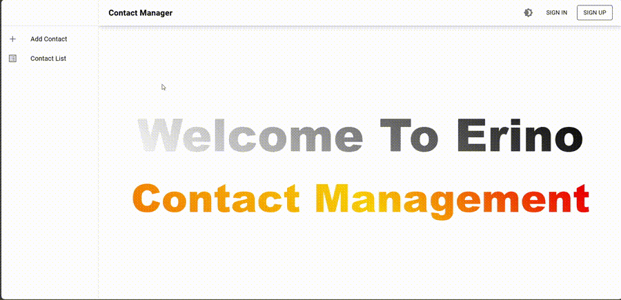

# Contact Manager 📝

A full-stack Contact management application built with React, Node.js, Express, and PostgreSQL. This app allows users to manage their contacts efficiently while supporting features like CRUD operations and themes.

---

### Demo Preview



---

## 🚀 Features
1. **Task Management**: Add, edit, delete, and view tasks.
2. **Contact Management**: Manage a list of contacts.
3. **Theme Support**: Light and dark themes for improved usability.
4. **Persistent Storage**: PostgreSQL for data storage with structured schemas.
5. **API-First Approach**: Backend designed with RESTful APIs.

---

## 🛠️ Tech Stack
- **Frontend**: React, React Router DOM, Context API
- **Backend**: Node.js, Express.js
- **Database**: PostgreSQL

---

## 📦 Project Setup

### **Prerequisites**
1. Install [Node.js](https://nodejs.org/) (v16 or higher)

2. Install [PostgreSQL](https://www.postgresql.org/)

3. Clone this repository:
   ```bash
   git clone https://github.com/Sarvesh804/Erino_Contact_Management.git
   cd Erino_Contact_Management


### Backend Setup
1. Navigate to the server folder:
   ```bash
   cd server

2. Create a new PostgreSQL database for the project:
   ```sql
   CREATE DATABASE contact_manager;

3. Install backend dependencies:
   ```bash
   npm install

4. Set up environment variables by creating a .env file in the server directory with the following content:
   ```bash
   DB_HOST=localhost
   DB_PORT=5000
   DB_USER=youruser
   DB_PASSWORD=yourpassword
   DB_NAME=contact_manager

5. Apply the database schema to initialize the tables:
   ```bash
   psql -U youruser -d contact_manager -f db/schema.sql

6. Start the backend server:
   ```bash
   npm start


### Frontend Setup
1. Navigate to the client folder:
   ```bash
   cd..
   cd client

2. Install frontend dependencies:
   ```bash
   npm install

3. Start the development server:
   ```bash
   npm start

---


## 🧠 Challenges and Solutions
1. Challenge: Ensuring state management is seamless across components.
-  Solution: Used Context API to manage the global state of the app effectively.

2. Challenge: Managing PostgreSQL connections securely.
-  Solution: Used environment variables to store database credentials securely and ensured .env is not tracked in version control.

3. Challenge: Implementing edit functionality with pre-populated data.
-  Solution: Used useEffect to set initial form data while avoiding infinite render loops.

---


## 🏗️ Major Technical Decisions
- React for UI Development: Ensured modularity and fast performance.
- PostgreSQL: Chosen for its relational structure and robust features.
- RESTful API: Simplified communication between the frontend and backend.


---

## Database: PostgreSQL

### Why PostgreSQL?

- Relational Data: Contacts often involve structured data that fits well in a relational model.
- Scalability: PostgreSQL is highly scalable and reliable for CRUD-heavy applications.
- Advanced Features: Supports indexing for faster search/sort, constraints to handle duplicates, and robust transaction handling.

